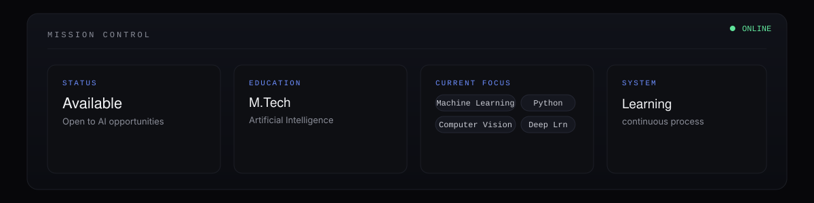
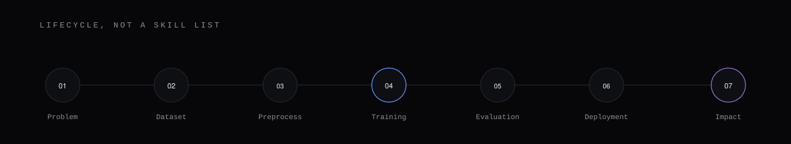

<!-- ========================================================= -->
<!--                    AI OPERATING SYSTEM                    -->
<!--            Crafted for Adil • GitHub Profile             -->
<!-- ========================================================= -->

<div align="center">



</div>

<br><br>

<div align="center">

# ADIL

### Artificial Intelligence Engineer

Building intelligent software that solves real-world problems.

<br>

<a href="#mission-control">

</a>

</div>

---

<br>

<table width="100%" id="mission-control">

<tr>

<td width="100%">



</td>

</tr>

</table>

<br><br>

<div align="center">

# MISSION CONTROL

</div>

<table width="100%">

<tr>

<td width="33%">

### STATUS

```text
● ONLINE
```

</td>

<td width="33%">

### EDUCATION

```text
M.Tech
Artificial Intelligence
```

</td>

<td width="33%">

### AVAILABILITY

```text
Open to
AI Opportunities
```

</td>

</tr>

</table>

<br>

<table width="100%">

<tr>

<td width="25%" align="center">

### MACHINE LEARNING

Designing models that transform raw data into reliable decisions.

</td>

<td width="25%" align="center">

### COMPUTER VISION

Building systems capable of interpreting the visual world.

</td>

<td width="25%" align="center">

### DEEP LEARNING

Research-driven neural architectures for intelligent applications.

</td>

<td width="25%" align="center">

### PYTHON

Developing scalable AI pipelines and production-ready tools.

</td>

</tr>

</table>

<br><br><br>


<br><br><br>

<div align="center">

# THE AI CORE

Not a collection of skills.

A connected intelligence system.

</div>

<br>



<br><br>

<div align="center">

<table>

<tr>

<td align="center">

### MACHINE LEARNING

Prediction

Optimization

Inference

</td>

<td width="80"></td>

<td align="center">

### COMPUTER VISION

Detection

Recognition

Segmentation

</td>

<td width="80"></td>

<td align="center">

### DEEP LEARNING

CNN

Transformers

Representation Learning

</td>

</tr>

<tr>

<td colspan="5" height="40"></td>

</tr>

<tr>

<td align="center">

### PYTHON

Automation

Data Pipelines

AI Tooling

</td>

<td></td>

<td align="center">

### OPEN SOURCE

Learning

Collaboration

Community

</td>

<td></td>

<td align="center">

### PROBLEM SOLVING

Competitive Programming

Algorithms

Data Structures

</td>

</tr>

</table>

</div>

<br><br><br>


<br><br><br>

<div align="center">

# INTELLIGENT DEVELOPMENT PIPELINE

Every successful AI solution follows a journey.

</div>

<br>



<br><br>

<div align="center">

| Stage | Purpose |
|-------|---------|
| Problem | Understand the objective |
| Dataset | Collect reliable information |
| Preprocessing | Transform noisy data |
| Training | Learn useful representations |
| Evaluation | Measure performance |
| Deployment | Deliver value |
| Impact | Improve real-world outcomes |

</div>

<br><br><br>


<br><br><br>

<div align="center">

# FEATURED SYSTEMS

Engineering solutions through research, experimentation, and practical implementation.

</div>

<br>

<table width="100%">

<tr>

<td width="48%" valign="top">

## Predictive Maintenance

Industrial intelligence platform focused on anticipating equipment failures before they occur.

#### Technologies

- Python
- Machine Learning
- Data Processing
- Feature Engineering
- Predictive Analytics

<br>

<p align="center">

<a href="https://github.com/4M5">


</a>

</p>

</td>

<td width="4%"></td>

<td width="48%" valign="top">

## Gesture Virtual Mouse

Real-time computer vision application enabling touchless interaction through hand tracking.

#### Technologies

- Python
- OpenCV
- MediaPipe
- Computer Vision

<br>

<p align="center">

<a href="https://github.com/4M5">


</a>

</p>

</td>

</tr>

<tr>

<td height="40"></td>

</tr>

<tr>

<td valign="top">

## RAT-SQL

Natural language to SQL system exploring relational-aware transformers for database querying.

#### Technologies

- NLP
- Transformers
- Deep Learning
- Python

<br>

<p align="center">

<a href="https://github.com/4M5">


</a>

</p>

</td>

<td></td>

<td valign="top">

## Paper Element Retriever

AI-powered document understanding pipeline for intelligent extraction of structured research content.

#### Technologies

- OCR
- Computer Vision
- Python
- Deep Learning

<br>

<p align="center">

<a href="https://github.com/4M5">


</a>

</p>

</td>

</tr>

</table>

<br><br><br>


<br><br><br>

<div align="center">

# DEVELOPER ANALYTICS

</div>

<br>


<br>

<table width="100%">

<tr>

<td align="center">

## Repositories

Growing collection of AI-focused projects and experiments.

</td>

<td align="center">

## Contributions

Consistent progress through continuous learning and development.

</td>

<td align="center">

## Languages

Python-first with a focus on practical machine learning systems.

</td>

<td align="center">

## Competitive Programming

Strengthening algorithmic thinking through regular problem solving.

</td>

</tr>

</table>

<br><br>

<!-- README CONTINUES IN PART 2 -->
