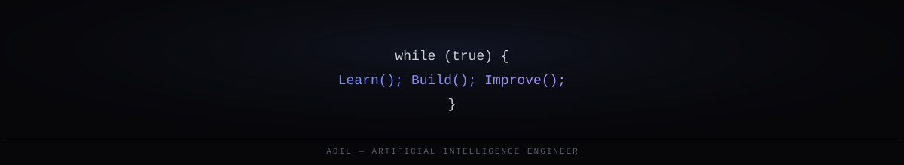

## Mission Control

## Discipline Map

## How the Work Actually Happens

## Featured Work

<table>
<tr>
<td width="50%" valign="top">
<h3>Paper Element Retriever</h3>

Multimodal retrieval system for research papers — reasons over text, figures, and tables together instead of chunked text alone. Figures and tables are routed through a vision model for grounding before entering the same vector index as text, so a query about a specific table resolves to the table, not nearby prose.

<code>ChromaDB</code> <code>Ollama</code> <code>LLaMA 3.1</code> <code>LLaVA</code>

</td>
<td width="50%" valign="top">
<h3>Gesture Virtual Mouse</h3>

Cursor control through gesture, voice, or eye tracking — no additional hardware. Real-time landmark tracking runs at 25 FPS.

<code>MediaPipe</code> <code>OpenCV</code> <code>Python</code>

</td>
</tr>
<tr>
<td width="50%" valign="top">
<h3>RAT-SQL — Text-to-SQL</h3>

Relation-aware transformer that converts plain English into executable SQL. Benchmarked on Spider: 73% exact match, 63% execution accuracy.

<code>Transformers</code> <code>NLP</code> <code>Spider Benchmark</code>

</td>
<td width="50%" valign="top">
<h3>Predictive Maintenance</h3>

<em>Description pending — send repo link, stack, and any benchmark numbers and this card gets rewritten with the real specifics instead of a placeholder.</em>

<code>details needed</code>

</td>
</tr>
</table>

## Developer Analytics

 

 

 

## Contribution Snake

<!--
Powered by the workflow in <code>.github/workflows/snake.yml</code> — runs daily, no manual upkeep.
-->

